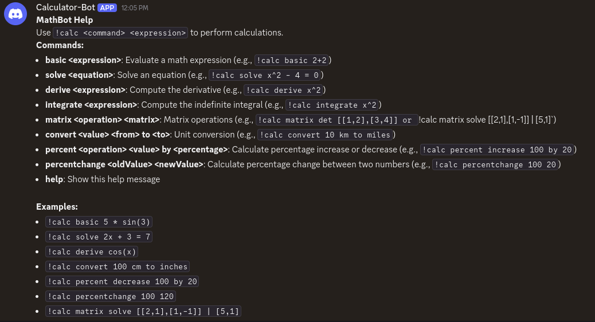

# Discord Calculator Bot


A Discord bot for performing mathematical calculations, including basic arithmetic, equation solving, derivatives, integrals, matrix operations, unit conversions, percentage calculations, and linear system solving. Built with Node.js, Discord.js, `mathjs`, and `nerdamer`, with a modular design and comprehensive test suite using Jest.

Connect this bot to your Discord server [here](https://discord.com/oauth2/authorize?client_id=1365359291716079838&permissions=3072&integration_type=0&scope=bot)

## Table of Contents
* [Screenshots](#screenshots)

* [Features](#features)

* [Project Structure](#project-structure)

* [Prerequisites](#prerequisites)

* [Installation](#installation)

* [Usage](#usage)

* [Tests](#tests)

* [Development](#development)

* [Contributing](#contributing)

* [Questions](#questions)

* [License](#license)

## Screenshots


## Features

- **Commands**:
  - `basic <expression>`: Evaluate a math expression (e.g., `!calc basic 2+2` → `Result: 4`).
  - `solve <equation>`: Solve an equation for `x` (e.g., `!calc solve x^2 - 4 = 0` → `Solutions: 2, -2`).
  - `derive <expression>`: Compute the derivative (e.g., `!calc derive x^2` → `Derivative: 2 * x`).
  - `integrate <expression>`: Compute the indefinite integral (e.g., `!calc integrate x^2` → `Indefinite Integral: (1/3)*x^3 + C`).
  - `matrix <operation> <matrix>`: Perform matrix operations (`det`, `inv`, `solve`):
    - `det`: Compute the determinant (e.g., `!calc matrix det [[1,2],[3,4]]` → `Determinant: -2`).
    - `inv`: Compute the inverse (e.g., `!calc matrix inv [[4,7],[2,6]]` → `Inverse: [[0.6,-0.7],[-0.2,0.4]]`).
    - `solve`: Solve a linear system using `lsolve` (e.g., `!calc matrix solve [[2,1],[1,-1]] | [5,1]` → `Solutions: 2, 1`).
  - `convert <value> <from> to <to>`: Convert units (e.g., `!calc convert 10 km to miles` → `Result: 6.21371... miles`).
  - `percent <operation> <value> by <percentage>`: Calculate percentage increase or decrease (e.g., `!calc percent increase 100 by 20` → `Result: 120`).
  - `percentchange <oldValue> <newValue>`: Calculate percentage change between two numbers (e.g., `!calc percentchange 100 20` → `Result: 80% decrease`).
  - `help`: Display the help message with command details.

- **Modular Design**: Command logic is organized in `utils/commands.js` for maintainability.
- **Testing**: Comprehensive test suite using Jest, located in `__tests__/commands.test.js`, covering all commands.
- **Error Handling**: Robust input validation and error messages for invalid inputs.

## Project Structure
```
discord-calculator/
├── tests/
│   └── commands.test.js      # Jest test suite for commands
├── utils/
│   └── commands.js          # Command logic (basic, solve, derive, etc.)
├── index.js                 # Main bot logic
├── package.json             # Dependencies and scripts
├── .env                     # Environment variables (DISCORD_TOKEN)
└── README.md                # Project documentation

```


## Prerequisites

- **Node.js**: Version 16 or higher.
- **Discord Bot Token**: Obtain from the [Discord Developer Portal](https://discord.com/developers/applications).

## Installation

1. **Clone the Repository** (if applicable):
   ```bash
   git clone <repository-url>
   cd discord-calculator
   ``` 
    - Install Dependencies
    `npm install`

    - Set up Environment Variables
        1. Create a .env file in the project root:
        `DISCORD_TOKEN=your-bot-token`

        2. Replace `your-bot-token` with your Discord bot token


## Usage
Run the bot using `npm start` or `node index.js`
    
- The bot will log in and dispplay `Logged in as Calculator-Bot#6890!`

    - Interact with the Bot:
        - Use commands in a Discord server where the bot is invited.
        - Prefixes: !calc or /calc.

    - Example commands:

        - Basic Calculation: `!calc 5 * sin(3)` or `!calc basic 2 + 2`

        - Solve Equation: `!calc solve 2x + 3 = 7` (returns x = 2) (not functioning)

        - Derivative: `!calc derive x^2` (returns 2x)

        - Integral: `!calc integrate x^2` (returns x^3/3 + C) (not functioning)

        - Matrix Determinant: `!calc matrix det [[1,2],[3,4]]` (returns -2)

        - Unit Conversion: `!calc convert 10 km to miles` (returns 6.21371 miles)

        - Help: `!calc help` (shows the help menu)


  

## Tests
The project includes a Jest test suite to verify command functionality.

- Run Tests:
    `npm test`
    - Runs all tests in `__tests__/commands.test.js`

- Run Tests with Coverage
    `npm run test:coverage`
    - Generates a coverage report in the `coverage/` folder

## Development
- Adding New Commands 
    - Add new functions to utils/commands.js.
    - Update the command handler in index.js.
    - Add corresponding tests in __tests__/commands.test.js.

- Debugging:
    - Check console logs for command parsing and errors.
    - Use npm test to verify functionality after changes.


## Contributing

- Fork the repository.

- Create a new branch (git checkout -b feature/new-command).

- Make changes and add tests.

- Commit changes (git commit -m "Add new command").

- Push to the branch (git push origin feature/new-command).

- Create a pull request.


## License

This project is licensed under the MIT license.


## Questions
You can find more of my work at [austinslatey](https://github.com/austinslatey/).

